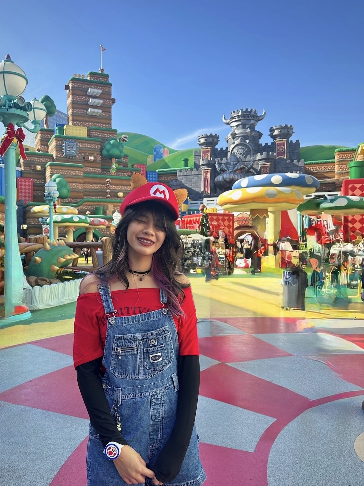

# Cathlyn Goldberg

## About Me
Hi! I’m a _computer science major_ at UC San Diego with minors in _design_ and _business_. I bring a **triple-lens perspective**, combining engineering, design, and business thinking to build user-centered solutions. I’m passionate about **bridging creativity and technology** to create tools that make people’s lives easier. Outside of class, I enjoy playing video games, modding my car, and traveling.

<picture>
    
</picture>

> Text that is quoted

### My Experience
  1. The Great Game
    - full-stack development - SE
  2. FRC Robotics
    - made cool robot
  3. AVID Tutor
    - Tutored some kids
  4. 3D Modeler & Woodworker
    - Made wooden sliders and stuff in blender

### To-do List
- [X] Read for CAT 125
- [X] Finish Lab 1
- [] Do CSE 101 Hw 1

## External Links:
[LinkedIn](www.linkedin.com/in/cathlyngoldberg)

## Section Links:
[My Name](#cathlyn-goldberg)
[About Me](#about-me)

## Relative Links:
[Learn more about me](README.md)
